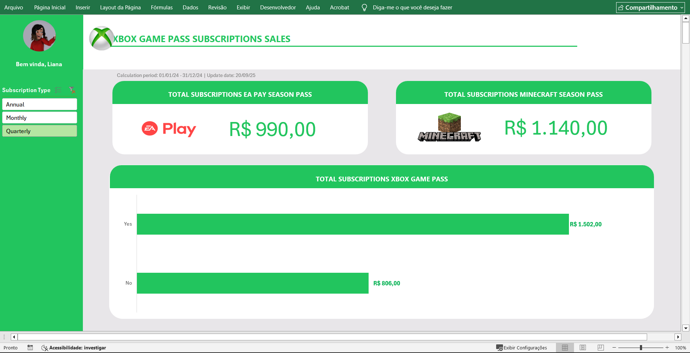

# Projeto Oficina

## 📋 Descrição
Projeto prático realizado na plataforma ***DIO*** em parceria com a ***Randstad***, com foco na criação de um dashboard de vendas para organizar e visualizar dados.

## 🎯 Objetivo
Transformar dados brutos em informações visuais claras e úteis, facilitando a análise de desempenho de vendas e a tomada de decisões com base nos dados.

## 📝 Orientação para a entrega
### Organizar o repositório do GitHub com:
- README.md explicando o projeto, os dados utilizados e instruções para reprodução.
- O arquivo Excel (.xlsx) com o dashboard concluído.
- Compartilhar o link do repositório GitHub como entrega do desafio.

## 🛠️ Ferramentas
- [Microsoft Excel](https://www.microsoft.com/pt-br/microsoft-365/excel)

## ✅ Perguntas Respondidas no Dashboard:
1. Qual é o **faturamento total das vendas de planos anuais**?
2. Qual é o **faturamento total das vendas de planos anuais**, separado por renovação automática (Sim/Não)?
3. Qual é o **total de vendas** das assinaturas do **EA Play Season Pass**?
4. Qual é o **total de vendas** das assinaturas do **Minecraft Season Pass**?

## 📈 Visualização Final do Projeto

